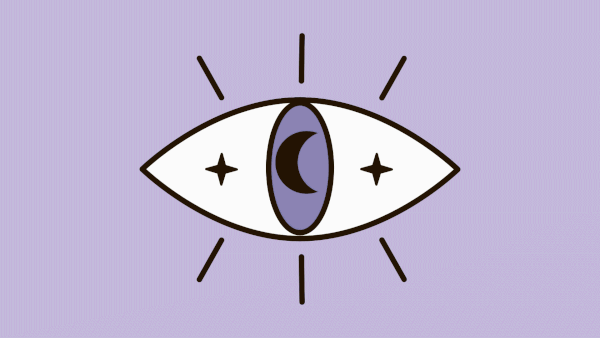

# Katrina MacAdams – Tarot Vue API Project  
---

## 🔮 Overview

Welcome to the World of Tarot — a mystical single-page Vue.js application that connects to a custom-built Lumen API to showcase a dynamic tarot card experience.

This project was developed as part of a web development assignment, with the objective of building a responsive frontend using Vue and AJAX that communicates with a custom backend REST API powered by Lumen and MySQL.

Each card represents one of the five suits in tarot: Major Arcana, Cups, Swords, Wands, and Pentacles — with two cards featured from each. Users can reveal upright meanings, flip cards to view reversed meanings, and uncover suit lore — all within a magical and responsive interface enhanced by GreenSock animations.

---

## 🧙‍♀️ Features

- 🃏 **Dynamic Card Reveal** – Click buttons to display upright or reversed tarot meanings.
- 🌪 **Flip Card Effect** – Seamlessly switch between meanings using Vue logic and GreenSock animations.
- ✨ **GreenSock (GSAP) Enhanced UI** – Magical entrance animations, floaty effects, glowing buttons, and more.
- 🔗 **RESTful API Integration** – Powered by Lumen and MySQL, the frontend fetches and displays data from two joined tables (`cards` and `suits`).
- 📱 **Responsive Design** – Smooth transitions from desktop grid layout to mobile-friendly stacking.
- 🌙 **Suit Lore Display** – Learn about the symbolic suits of tarot through structured suit data.
- 🧘‍♀️ **Minimal + Mystical Aesthetic** – A calming font pairing and gentle animations to create an immersive spiritual experience.

---

## 🧰 Tech Stack

- **Frontend:** Vue.js 3 (via CDN), HTML5, CSS Grid/Flexbox, GSAP
- **Backend:** Lumen (Laravel micro-framework), PHP, MySQL
- **Tools:** VS Code, GitHub, and GSAP Plus

---

## 🛠 Installation

There’s no complex setup required — just clone and open.

1. Clone this repo to your local machine using GitHub Desktop or via CLI.
2. Ensure your PHP server is running to support Lumen.
3. Import the provided `.sql` file into MySQL.
4. Add your `.env` file to connect the Lumen app to your DB.
5. Open `index.html` in your browser to view the Vue frontend.

---

## 🌀 Usage

- Click **Reveal Meaning** on a card to display its upright interpretation.
- Click **Flip Card** to toggle to the reversed meaning (and back again).
- Click **Reveal Suit** to display the symbolic background of the card's suit.
- Experience smooth animations powered by GSAP and elegant tarot-themed UI.

---

## 📜 API Endpoints

| Route           | Method | Description                                 |
|----------------|--------|---------------------------------------------|
| `/cards`       | GET    | Returns all cards with joined suit data     |
| `/cards/{id}`  | GET    | Returns a single card with its suit info    |
| `/suits`  | GET         | Returns suit info                           |

---

## 🧪 Development History

- **v1.0.0 - April 10, 2025**
    - Initial setup of Vue + Lumen structure
    - Created database with joined `cards` and `suits` tables

- **v1.1.0 - April 11, 2025**
    - Created responsive layout and UI interactions
    - Hooked up full API integration

- **v1.2.0 - April 13, 2025**

  - Added GSAP animations
  - Final UI polish, accessibility enhancements
   - Scroll-triggered animations and dynamic overlays added

> [!NOTE]
> This application is built as a project assignment and is currently in its first stable version. It may evolve further as a portfolio feature.

---

## 💖 Credits

**Developer & Designer:**  
Katrina MacAdams  
k_macadams@fanshaweonline.ca

**Mentorship & Guidance:**  
Fanshawe College Professors

**Image Sources:**   
https://biddytarot.com

**Animations Powered By:**  
GreenSock (GSAP)  
https://greensock.com/

---

## 📄 License

MIT License – Feel free to use for learning and inspiration.

